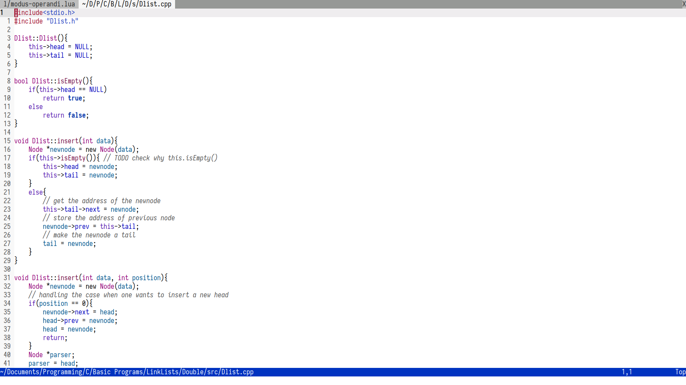
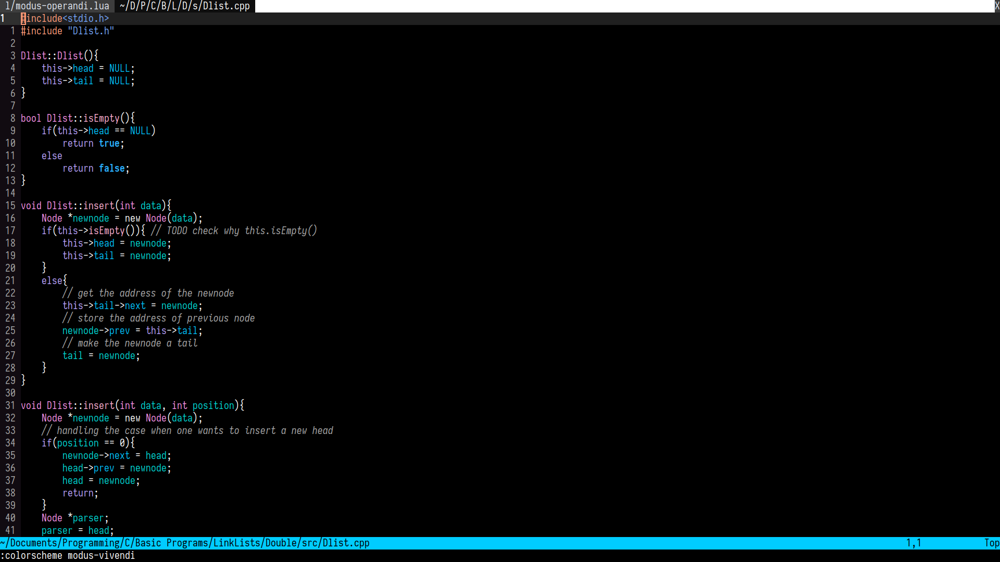
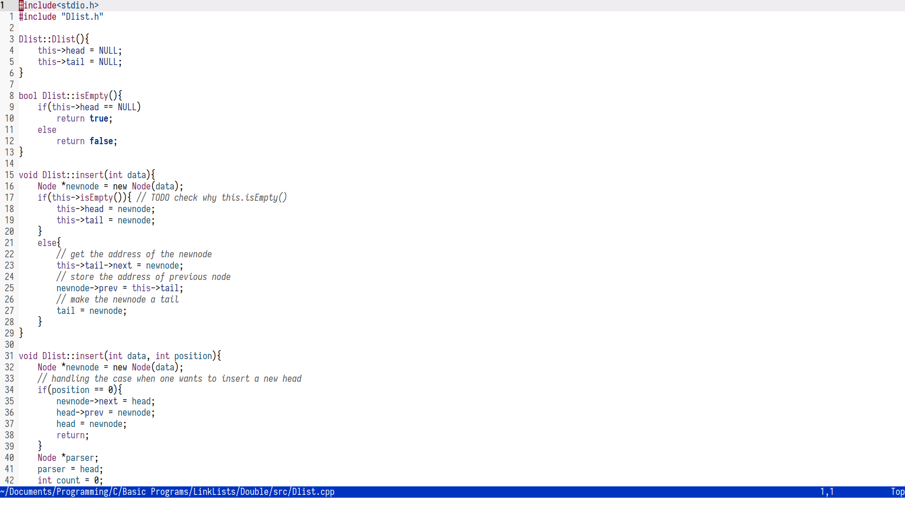
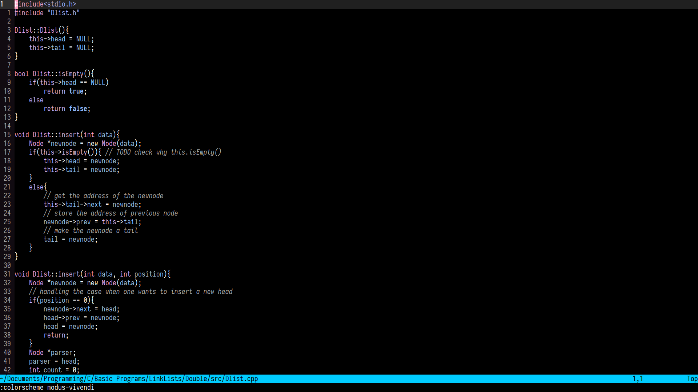

Modus Color Schemes
=====================

This is a color scheme developed by *Protesilaos Stavrou* for emacs. I have attempted to port it to neovim using lua.

There are 2 color schemes


modus-operandi ( the light theme )


modus-vivendi ( the dark theme )

NOTE
----
The master branch of the theme no longer depends on colorbuddy.

Getting Started
---------------

If you are using the stable neovim install  [`tjdevries/colorbuddy.nvim`](https://github.com/tjdevries/colorbuddy.vim)
and use the stable branch of this theme.
Also make sure to enable termguicolors

### Vim Plug

```viml
Plug 'ishan9299/modus-theme-vim'  -- if using nightly neovim
Plug 'ishan9299/modus-theme-vim', {'branch': 'stable'} -- only if you are not using nightly
```

### Minpac

```viml
call minpac#add('ishan9299/modus-theme-vim') -- if using nightly neovim
call minpac#add('ishan9299/modus-theme-vim', {'branch': 'stable'}) -- only if you are not using nightly
```

### Vim Packages

In the terminal execute this command. Read `:h packages`
```sh
cd ~/.config/nvim
mkdir -p pack/packages/{opt,start}
git submodule add --name modus-theme-vim https://github.com/ishan9299/modus-theme-vim pack/packages/start/modus-theme-vim
```
### Packer.nvim
``` lua
  use 'ishan9299/modus-theme-vim'
```

### To set the current theme.
```lua
vim.cmd('colorscheme modus-vivendi')
```

Plugins Explicitly Configured
-----------------------------
- TreeSitter
- Telescope
- Startify
- gitsigns
- GalaxyLine
- nvim-ts-rainbow

Please feel free to open an issue if you want other plugins to be included.

Configuration
--------------
The theme has a faint syntax options which dims the colors if you find the default distracting.
```lua
vim.g.modus_faint_syntax = 1
```
  



It also provides a by default configured statusline using galaxyline plugin.
To use it
```lua
vim.g.modus_moody_enable = 1
```
or
```viml
let g:modus_moody_enable = 1
```

There are additional options also
```lua
vim.g.modus_yellow_comments = 1 -- also enable the faint syntax
vim.g.modus_green_strings = 1
```

All these options are disabled by default.

Syntax Highlighting Configured for these languages
--------------------------------------------------
- viml
- python
- nix
- lua

TreeSitter is supported if there is a language that isn't properly highlighted please open an issue.

## NOTE
- vim is not supported.
- It is not well tested with the stable neovim (version 0.4.4) please open an issue or consider using nightly.
- For using these colorschemes in your terminal
  + Kitty
    + [modus-operandi](https://github.com/ishan9299/Nixos/blob/d4bbb7536be95b59466bb9cca4d671be46e04e81/user/kitty/themes/modus-operandi.conf#L1-L47)
    + [modus-vivendi](https://github.com/ishan9299/Nixos/blob/d4bbb7536be95b59466bb9cca4d671be46e04e81/user/kitty/themes/modus-vivendi.conf#L1-L48)
  + [Alacritty](https://github.com/ishan9299/Nixos/blob/d4bbb7536be95b59466bb9cca4d671be46e04e81/user/alacritty/alacritty.yml#L30-L118)
