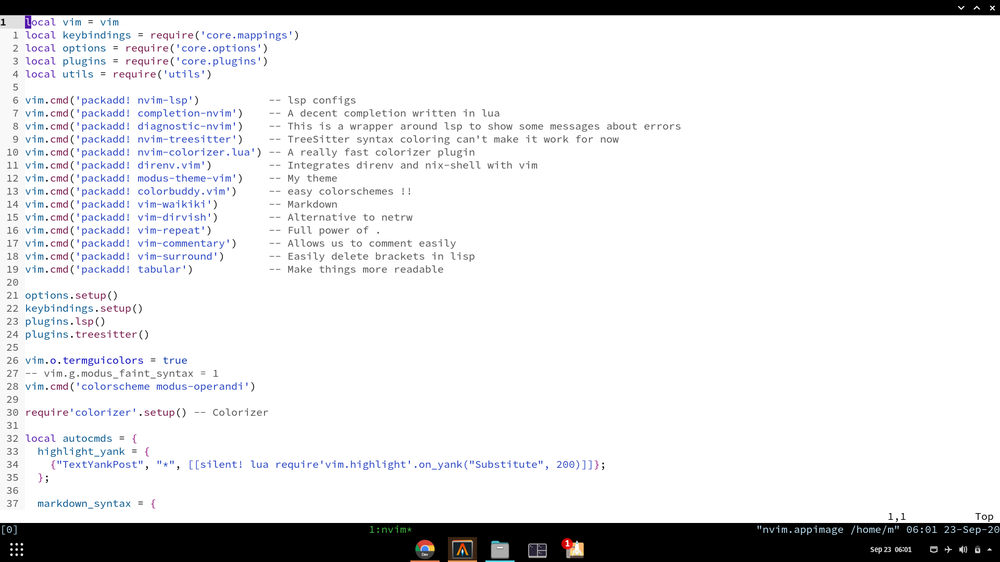
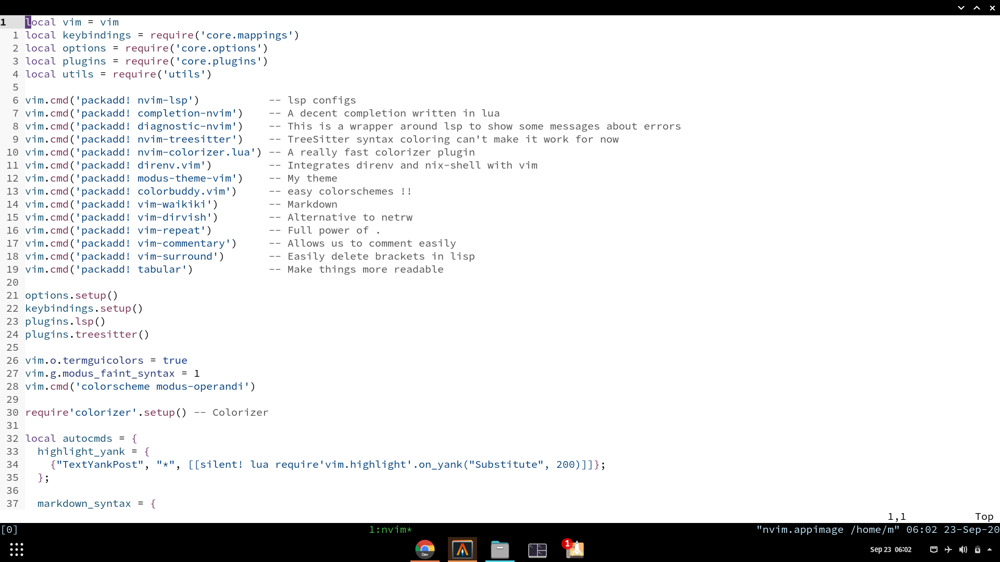
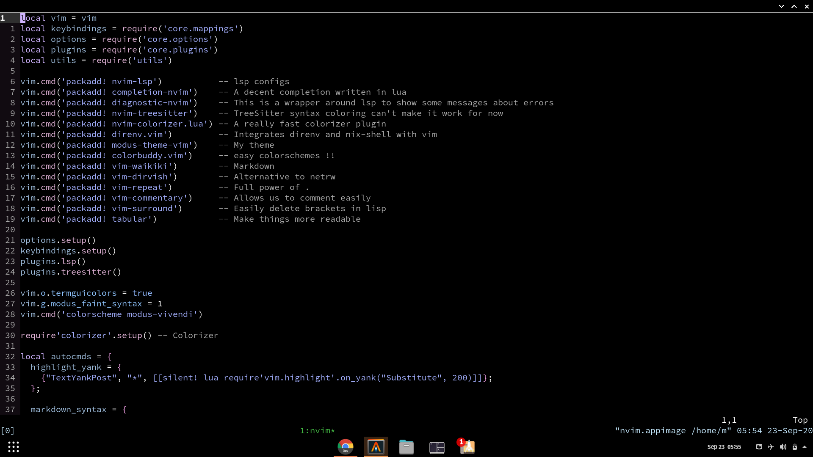

Modus Color Schemes
=====================

This is a color scheme developed by *Protesilaos Stavrou* for emacs. I have attempted to port it to neovim using lua.  

There are 2 color schemes



modus-operandi ( the light theme )  


modus-vivendi ( the dark theme )  

Getting Started
---------------

You have to make sure you install [`tjdevries/colorbuddy.vim`](https://github.com/tjdevries/colorbuddy.vim)
Only `termguicolors` are supported and that will not change.  

### Vim Plug

```
Plug 'tjdevries/colorbuddy.vim'
Plug 'ishan9299/modus-theme-vim'
```

### Minpac

```viml
call minpac#add('tjdevries/colorbuddy.vim')
call minpac#add('ishan9299/modus-theme-vim')
```

### Vim Packages
In the terminal execute this command.
```sh
cd ~/.config/nvim && git submodule add --name colorbuddy https://github.com/tjdevries/colorbuddy.nvim pack/packages/opt/colorbuddy.nvim
cd ~/.config/nvim && git submodule add --name modus-theme-vim https://github.com/ishan9299/modus-theme-vim pack/packages/opt/modus-theme-vim
```
In your `init.vim` add the following
```
packadd! modus-theme-vim
```

To set the current theme.

```viml
lua require('colorbuddy').colorscheme('modus-operandi')
```
or
```viml
colorscheme modus-operandi
```

Configuration
--------------
The theme has a faint syntax options which dims the colors if you find the default distracting.
```lua
vim.g.modus_faint_syntax = 1
```
or
```viml
let g:modus_faint_syntax = 1
```
  


NOTE
----

- Vim is not supported because the theme is written in lua.
- If you use the plasticboy's markdown plug-in or vim-pandoc-syntax you can't get the different background color for markdown headings.
- I have not tested the stable release (i.e 0.4.4) if you encounter some problems open an issue.
- There is an issue with the modus-operandi-theme(the light version) where the cursor is not visible in empty line. To fix that enable the cursorline in neovim.
